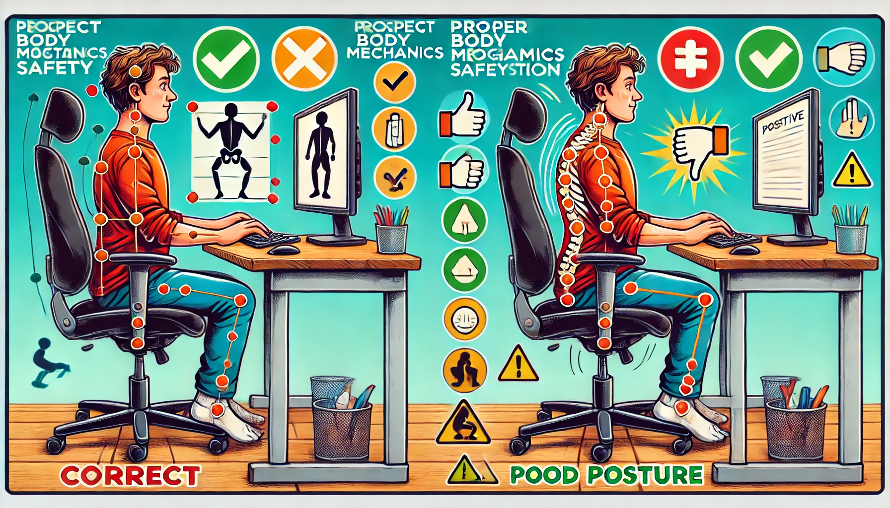
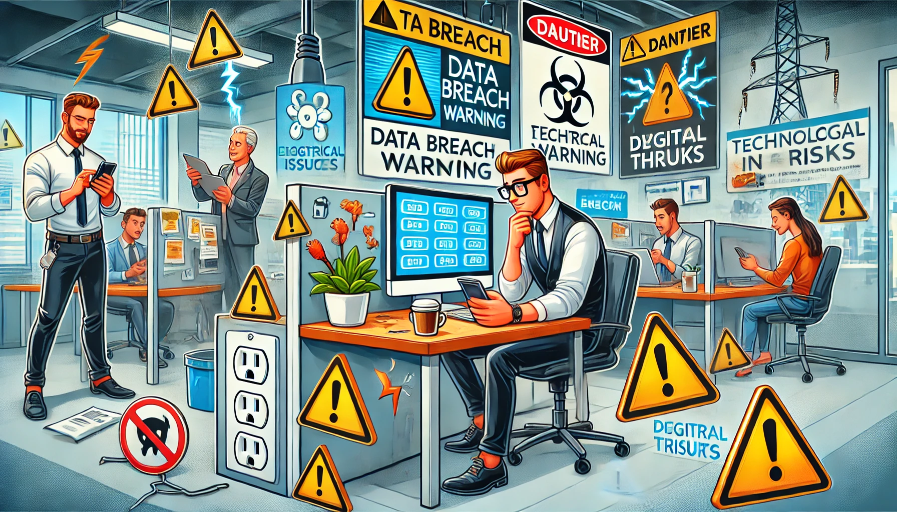

# Prevención de riesgos ergonómicos y tecnológicos en el trabajo

El riesgo ergonómico es un factor que puede afectar la salud y el bienestar de los trabajadores en su entorno laboral. Consiste en la posibilidad de sufrir lesiones o enfermedades debido a la falta de adaptación entre el trabajador y su puesto de trabajo.

La falta de adaptación de los puestos de trabajos a las características y capacidades de los trabajodres pueden tener consecuencias negativas para la salud de los trabajadores como lesiones musculoesqueléticas, trastornos musculares, fatiga, estrés y un largo etcétera que pueden afectar a la productividad y eficencia laboral, ya que un trabajador que se encuentra en un entorno laboral poco ergonómico puede experimentar dificultades para realizar sus tareas de manera eficiente y segura.

-------------------------------------------------------------------------

---------------------------------------------

## Riesgos tecnológicos

Los riesgos teconlógicos es la probabilidad de que un objeto, material o proceso peligroso, una sustancia tóxica o peligrosa o bien un fenómeno debido a la interacción de estos, ocasione un número determinado de consecuencias a la salud, la economía, el medio ambiente y el desarrollo integral de un sistema. Con la evolución de los beneficios tecnológicos surgen nuevas formas y métodos de trabajo que los empleadores han implementado, desde los avances más sencillos hasta los más innovadores, todo pensado en el bienestar de los trabajadores y la prevención de riesgos tecnológicos y de seguridad en el trabajo.

 ----------------------------------------------------

 

 -------------------------------------------------------
